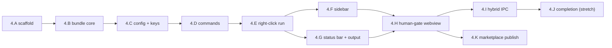
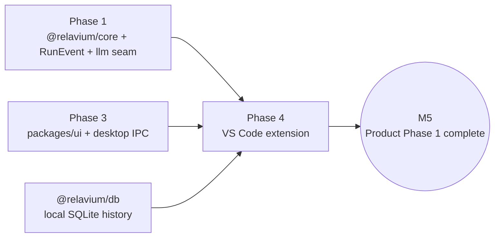

# Phase 4 — VS Code extension

> Status: Not started (Product Phase 1, final build phase). Blocked on Phase 3.

- **Related**: [../README.md](../README.md), [phase-3-desktop.md](phase-3-desktop.md), [phase-5-managed-inference.md](phase-5-managed-inference.md) (next phase, first Phase-2 deliverable), [phase-6-cloud-execution-portal.md](phase-6-cloud-execution-portal.md), [../../architecture/shared-core-engine.md](../../architecture/shared-core-engine.md), [../../architecture/local-first-and-security.md](../../architecture/local-first-and-security.md), [../../reference/vscode/extension-api.md](../../reference/vscode/extension-api.md), [../../reference/contracts/sse-event-schema.md](../../reference/contracts/sse-event-schema.md), [../../reference/contracts/ipc-contract.md](../../reference/contracts/ipc-contract.md), [../../reference/contracts/workflow-yaml-spec.md](../../reference/contracts/workflow-yaml-spec.md), [../../decisions/0007-desktop-is-not-an-ide.md](../../decisions/0007-desktop-is-not-an-ide.md), [../../decisions/0006-os-keychain-for-api-keys.md](../../decisions/0006-os-keychain-for-api-keys.md), [../../decisions/0011-internal-llm-abstraction.md](../../decisions/0011-internal-llm-abstraction.md)

## Goal

Ship the standalone VS Code extension (`apps/vscode-extension`) that **bundles
`@relavium/core` in-process** in the extension host — installable and fully
functional with **no desktop app present**. It is the highest-leverage
distribution channel: developers trigger a workflow on the file they are already
looking at, watch streaming status in the sidebar and status bar, and approve
human gates in a webview. Because the engine is pure TypeScript with zero
platform-specific imports (proven since Phase 1), this is a bundling and VS Code
API-integration phase — not an engine port. Completing it closes out **Product
Phase 1** (milestone M5).

## Outcomes (Definition of Done)

- A published `relavium.relavium` extension installable from the VS Code
  Marketplace that runs workflows with **no desktop app required**.
- `@relavium/core` bundled and running inside the VS Code Node extension host,
  emitting the **same canonical [`RunEvent`](../../reference/contracts/sse-event-schema.md)
  stream** as the CLI and desktop.
- Right-click-to-run from the editor and explorer context menus, with workflows
  filtered by input-schema compatibility and chosen in a QuickPick.
- A sidebar `relavium` view container (Workflows, Agents, Active Runs) and a
  status-bar run monitor, both driven by the colon-namespaced run events.
- A human-gate `WebviewPanel` (reusing `packages/ui`) that blocks a run and
  resumes it on Approve/Reject, round-tripped over the engine's resume API.
- API keys read via `vscode.SecretStorage` (OS keychain) and never written to
  `settings.json`, workflow YAML, or run-trace exports.
- Shared local SQLite history via `@relavium/db`, so runs are visible to the CLI
  and desktop.
- Optional **desktop-enhanced** mode auto-detected over loopback IPC, degrading
  silently to standalone when the desktop app is absent.

## Scope

### In scope

- An extension (`apps/vscode-extension`) that **bundles `@relavium/core`
  in-process** in the extension host (`src/engine/`), per
  [../../reference/vscode/extension-api.md](../../reference/vscode/extension-api.md)
  and [../../architecture/shared-core-engine.md](../../architecture/shared-core-engine.md).
  No dependency on the desktop app.
- **Commands** (`relavium.*`) and **right-click run**: invoke a workflow from the
  editor/explorer context menu and the command palette, with compatible workflows
  filtered by input schema (`relavium.runWorkflowOnFile`, `relavium.runWorkflow`).
- **Config + key access**: `relavium.*` settings in `settings.json`, with API
  keys held only in `vscode.SecretStorage` (OS keychain), per
  [0006-os-keychain-for-api-keys.md](../../decisions/0006-os-keychain-for-api-keys.md).
- **Sidebar**: a `relavium` view container with three `TreeDataProvider`s —
  Workflows (from `.relavium/*.relavium.yaml`), Agents (from
  `.relavium/agents/*.agent.yaml`), and Active Runs (live, per-node, with inline
  `[Approve]`/`[Reject]`).
- **Status-bar run monitor**: a `vscode.StatusBarItem` reflecting idle / running
  / awaiting-human / completed / failed states.
- **Run output + streaming**: per-run `OutputChannel`, token batching on
  `relavium.streamingBatchIntervalMs`, gutter/tree decorations for the active node.
- **Human-gate webview**: approve/deny a `human_gate:paused` gate in a
  `WebviewPanel`, reusing `packages/ui` components, dispatching to the same engine
  resume action as the sidebar inline buttons.
- Reads the same git-native `.relavium/*.relavium.yaml` files; uses local SQLite
  history via `@relavium/db` so runs are shared with the CLI/desktop.
- **Hybrid desktop-enhanced detection** over the loopback IPC contract
  ([ipc-contract.md](../../reference/contracts/ipc-contract.md)): probe the
  desktop app on `relavium.desktopAppPort` and unlock `openWorkflowInDesktop`/
  status sync if present; silent standalone fallback otherwise.
- **Marketplace packaging**: `vsce` packaging, `.vscodeignore`, publisher setup,
  CI publish on tag.

### Explicitly out of scope

- The full ReactFlow canvas editor — authoring stays in the desktop app
  ([0007-desktop-is-not-an-ide.md](../../decisions/0007-desktop-is-not-an-ide.md));
  the extension triggers and monitors, it does not become a second canvas.
- The full **language server** (YAML IntelliSense, diagnostics, rename) described
  in [extension-api.md](../../reference/vscode/extension-api.md#language-server) —
  a follow-up after the marketplace MVP. JSON-Schema-backed completion is wired in
  this phase as a stretch (see 4.J) but the standalone LSP process is deferred.
- Accounts and `relavium.executionMode = 'managed'` (the opt-in managed-inference
  mode) — Product Phase 2, first introduced in
  [phase-5-managed-inference.md](phase-5-managed-inference.md). Cloud execution, the
  web portal, and `relavium.executionMode = 'cloud'` — Product Phase 2 cloud
  ([phase-6-cloud-execution-portal.md](phase-6-cloud-execution-portal.md)).
- Scheduled / webhook triggers and email/Slack gate notifications — Product
  Phase 2.

## Work breakdown

The workstreams are ordered: scaffold and bundling first (4.A–4.B), then the
core trigger path (4.C–4.E), then monitoring and the gate (4.F–4.H), then
distribution (4.I–4.K). The spine's critical-path items for this phase are
**4.A, 4.B, 4.E, 4.H, 4.K**.

### 4.A — Extension scaffold and activation

Stand up `apps/vscode-extension` in the monorepo with the manifest, activation
events, and a CI-buildable VSIX skeleton.

**Tasks:**

- Create `apps/vscode-extension` with `package.json` declaring `engines.vscode`,
  `main`, `activationEvents`, `categories`, and the `relavium` `publisher`/`name`/
  `displayName`/`icon`.
- Set the activation event to `workspaceContains:.relavium` so the extension stays
  dormant in unrelated projects (per
  [extension-api.md](../../reference/vscode/extension-api.md#activation)).
- Wire Turborepo tasks (`build`, `package`, `lint`, `test`) and dev tooling
  (`@vscode/test-electron`, `vsce`), depending on `@relavium/core`,
  `@relavium/db`, `@relavium/shared`, and `packages/ui`.
- Scaffold `extension.ts` with `activate`/`deactivate`, a `subscriptions`
  disposable registry, and the `relavium.logLevel`-aware logger.
- Add an integration-test harness (`@vscode/test-electron`) that launches a
  headless VS Code with a fixture workspace.

**Acceptance:** `pnpm --filter vscode-extension build && package` produces a VSIX;
F5 launches the Extension Development Host, which activates only when a `.relavium/`
folder exists; the headless test harness opens the fixture workspace in CI.

### 4.B — Bundle `@relavium/core` in-process

Package the pure-TS engine to run inside the VS Code Node extension host with no
platform-specific imports, exercised from a smoke test. **Critical path.**

**Tasks:**

- Bundle `@relavium/core` + `@relavium/llm` + `@relavium/db` into the extension
  with `esbuild` (`platform: node`, `format: cjs`, `external: ['vscode']`),
  tree-shaken and source-mapped.
- Add an import-zone lint check to the bundle step confirming **no vendor LLM SDK
  type crosses the `@relavium/llm` seam** and no platform import leaks into core,
  per [0011-internal-llm-abstraction.md](../../decisions/0011-internal-llm-abstraction.md)
  (cross-phase invariant).
- Initialize the engine in `src/engine/` with a workspace-sandboxed root and the
  in-memory provider registry; subscribe to `RunEventBus` and project events to
  `vscode.EventEmitter` (`relavium.onRun*`).
- Verify checkpoint/resume and SQLite checkpointing operate under the extension
  host (same checkpoint shape as CLI/desktop).
- Add a smoke test: run a bundled fixture workflow end-to-end inside the test
  host and assert the canonical `run:started … run:completed` event sequence.

**Acceptance:** the bundled engine runs a fixture workflow inside the VS Code host
and emits the identical `RunEvent` sequence the CLI produces for the same workflow;
the import-zone check passes; no `vscode` symbol is referenced from inside `core`.

### 4.C — Configuration and key access (SecretStorage)

Contribute `relavium.*` settings and read API keys exclusively from the OS
keychain via `vscode.SecretStorage`.

**Tasks:**

- Declare the `relavium.*` settings in `contributes.configuration` with the
  defaults from
  [extension-api.md](../../reference/vscode/extension-api.md#settings-relavium)
  (`workflowsPath`, `maxConcurrentRuns`, `autoShowOutputOnRun`,
  `streamingBatchIntervalMs`, `providerTimeout`, `desktopAppPort`,
  `humanGateNotificationSound`, `telemetry: false`, `logLevel`).
- Implement a key store over `context.secrets` (`vscode.SecretStorage`); add
  `relavium.setProviderKey` / `relavium.clearProviderKey` commands using a masked
  `InputBox`.
- Read keys only at run start, pass them into the engine's in-memory provider
  registry, and clear them from memory on run completion.
- Add guards asserting keys are never written to `settings.json`, workflow YAML,
  the run-trace export, or any `RunEvent` payload (security model in
  [extension-api.md](../../reference/vscode/extension-api.md#security-model) and
  [local-first-and-security.md](../../architecture/local-first-and-security.md)).

**Acceptance:** a key entered via the command is stored in the OS keychain (never
in `settings.json`); a run reads it at start and the key is absent from logs,
exports, and events; settings round-trip through `settings.json`.

### 4.D — Commands and command palette

Register the `relavium.*` command surface so every action is keyboard- and
palette-discoverable before menus are wired.

**Tasks:**

- Register the commands from
  [extension-api.md](../../reference/vscode/extension-api.md#commands-relavium):
  `runWorkflow`, `runWorkflowOnFile`, `cancelRun`, `approveHumanGate`,
  `showRunHistory`, `getActiveRuns`, `refreshWorkflows`, `exportRunTrace`,
  `openWorkflowInDesktop` (no-op when desktop absent), `createAgent`.
- Group all commands under the `"Relavium"` category in `contributes.commands`.
- Implement a workspace workflow/agent registry that loads
  `.relavium/*.relavium.yaml` and `.relavium/agents/*.agent.yaml`, validated with
  the `@relavium/shared` Zod schemas, refreshed on `relavium.refreshWorkflows`
  and on a `FileSystemWatcher` event.
- Have `relavium.runWorkflow` return a `RunHandle` (`.on()` for events,
  `.cancel()`) so other extensions can consume it programmatically.

**Acceptance:** every command appears under "Relavium" in the palette and is
invocable; the registry loads and validates fixture workflows/agents and refreshes
on disk change.

### 4.E — Right-click "run workflow on file"

The signature trigger path: right-click a file, pick a compatible workflow, run
it on that file. **Critical path.**

**Tasks:**

- Contribute `editor/context` and `explorer/context` menu items bound to
  `relavium.runWorkflowOnFile`, plus a default keybinding.
- Filter workflows by input-schema compatibility with the selected file URI and
  present them in a `QuickPick` (showing tag, last-run status).
- Pass the file URI (and selection/workspace root where relevant) as run input;
  enforce `relavium.maxConcurrentRuns`.
- Honor `relavium.autoShowOutputOnRun` to focus the run output channel; emit
  `relavium.onRunStarted` and reveal the Active Runs tree node.
- Validate all file I/O goes through `vscode.workspace.fs` within the workspace
  boundary so it works in remote workspaces (SSH/WSL/Codespaces).

**Acceptance:** right-clicking a file in the editor and explorer offers only
input-compatible workflows; choosing one starts a run with the file as input and
the run begins streaming — with no desktop app present.

### 4.F — Sidebar tree (workflows / agents / runs)

A `relavium` view container with three live TreeViews driven by the registry and
the run-event stream.

**Tasks:**

- Contribute a `relavium` view container and three `contributes.views` entries
  with `TreeDataProvider`s: **Workflows** (grouped by tag, last-run status badge),
  **Agents**, and **Active Runs**.
- Render Active Runs as expandable nodes down to per-node status, updated from
  `node:started` / `node:completed` / `node:failed` / `cost:updated` events;
  auto-reveal the active node.
- Add inline `[Approve]`/`[Reject]` actions on a `human_gate:paused` run node,
  dispatching to `relavium.approveHumanGate`.
- Refresh Workflows/Agents on `relavium.onWorkflowsChanged` (FileSystemWatcher).

**Acceptance:** the sidebar lists fixture workflows and agents; starting a run adds
a live Active Runs node that expands to per-node status and updates as events
arrive; a paused gate shows inline Approve/Reject.

### 4.G — Status-bar run monitor and run output

Passive, ambient run awareness plus the streaming output surface.

**Tasks:**

- Add a right-aligned `vscode.StatusBarItem` (priority 100) reflecting idle
  (hidden), running (`$(loading~spin) N runs active`), awaiting-human (`$(bell)`,
  amber), completed, and failed; clicking opens the Active Runs view.
- Create a per-run `OutputChannel` and render `agent:token` events, batched on
  `relavium.streamingBatchIntervalMs` to avoid UI jank.
- Add a gutter decoration on the file being processed for the active node.
- Surface `run:completed` cost/duration and `run:failed` errors in the status bar
  and a dismissible notification.

**Acceptance:** during a run the status bar shows live run count and flips to an
amber bell on a pending gate; the output channel streams tokens smoothly at the
configured batch interval; cost and duration appear on completion.

### 4.H — Human-gate webview

The trust-boundary surface: approve/deny a `human_gate:paused` gate in a
`WebviewPanel`, resuming the run. **Critical path.**

**Tasks:**

- Build a `WebviewPanel` reusing `packages/ui` gate components for visual
  consistency with the desktop; render `message`, `gateType`
  (`approval`/`input`/`review`), `assignee`, and the timeout countdown from the
  `human_gate:paused` event.
- Implement webview ↔ host messaging (`postMessage`) with a strict CSP and a
  nonce; keep webview state thin (no engine logic in the webview).
- On Approve/Reject/Input, post a `GateDecision` to the host, which calls
  `engine.resume(runId, gateId, decision)`; the run continues and emits
  `human_gate:resumed`.
- Honor the node `timeout_action` on expiry (`decidedBy: 'timeout_escalation'`)
  and play the gate sound when `relavium.humanGateNotificationSound` is on.
- Route the same decision whether triggered from the webview or the sidebar inline
  buttons (single resume path).

**Acceptance:** a run that hits a human gate opens the webview, blocks until the
user acts, resumes on Approve and continues to `run:completed`; Reject and timeout
behave per the node's `timeout_action`; the webview never holds a secret.

### 4.I — Hybrid desktop-enhanced detection (loopback IPC)

Auto-detect a running desktop app to unlock enhanced features, degrading silently
to standalone.

**Tasks:**

- At activation, discover the desktop app from `~/.relavium/ipc.json` (dynamic port
  + bearer token, with `relavium.desktopAppPort` as an optional override) and probe
  its loopback health endpoint with a short timeout, per
  [ipc-contract.md](../../reference/contracts/ipc-contract.md#vs-code-mirror-loopback-http).
- When present, enable `relavium.openWorkflowInDesktop` and the
  `[Open in Designer]` CodeLens affordance; when absent, keep these as graceful
  no-ops with no user-visible degradation.
- Gate any IPC with the bearer token from the loopback handshake (dynamic port +
  token in `~/.relavium/ipc.json`, per
  [ipc-contract.md](../../reference/contracts/ipc-contract.md#vs-code-mirror-loopback-http));
  **never** send API keys to the desktop over IPC — the extension is standalone for
  key custody (security model).
- Make standalone the default and assert the absence of the desktop app does not
  change any execution behavior.

**Acceptance:** with the desktop app running, `openWorkflowInDesktop` jumps to the
canvas over authenticated loopback IPC; with it not running, the command is a
silent no-op and all execution still works standalone.

### 4.J — Schema-backed YAML completion (stretch)

Lightweight authoring help inside `.relavium/` YAML without the full language
server (which is deferred).

**Tasks:**

- Register a JSON Schema generated from the `@relavium/shared` Zod schemas for the
  `**/.relavium/**/*.{yaml,yml}` document selector (completion + basic validation
  through the built-in YAML association).
- Provide `agentId` and `modelId` completion from the workspace registry.
- Document the deferral of the standalone `yaml-language-server`-based LSP
  (diagnostics, hover, rename, go-to-definition) to a post-MVP follow-up, per
  [extension-api.md](../../reference/vscode/extension-api.md#language-server).

**Acceptance (stretch):** editing a `.relavium.yaml` offers completion for required
fields and `agentId`/`modelId` from the workspace; this item is optional and does
not gate the phase exit.

### 4.K — Marketplace packaging and publish

Package, sign, and publish `relavium.relavium` to the VS Code Marketplace.
**Critical path.**

**Tasks:**

- Finalize the manifest for marketplace (categories, keywords, gallery banner,
  `README.md`, `CHANGELOG.md`, license, icon) and a tuned `.vscodeignore` so the
  VSIX ships only the bundled output.
- Set up the `relavium` publisher and a marketplace PAT stored as a CI secret.
- Add a CI job that, on a release tag, runs `vsce package` then `vsce publish`,
  and attaches the VSIX to the GitHub release on `github.com/HodeTech/Relavium`.
- Smoke-test the published VSIX on macOS/Windows/Linux: install into a clean VS
  Code with **no desktop app**, run the full right-click → stream → gate → complete
  flow.

**Acceptance:** `relavium.relavium` is installable from the marketplace; on a clean
machine with no desktop app, the install-to-completion smoke test passes on all
three OSes; CI publishes on tag.

## Milestones

| In-phase milestone | Completed by | Maps to global |
| --- | --- | --- |
| 4.M1 — Engine bundled and runs in the extension host | 4.A + 4.B | (foundation for M5) |
| 4.M2 — Right-click run works standalone | 4.C + 4.D + 4.E | **M5** (right-click run) |
| 4.M3 — Live monitoring (sidebar + status bar + output) | 4.F + 4.G | M5 |
| 4.M4 — Human gate blocks and resumes in a webview | 4.H | **M5** (gate webview) |
| 4.M5 — Published to the marketplace | 4.K | **M5** (marketplace publish) |

> Milestone **M5 — Product Phase 1 complete: standalone VS Code extension
> shipped** is achieved by **4.E + 4.H + 4.K**.

## Dependencies

- **Phase 3** complete: `packages/ui` exists (reused by the gate webview) and the
  engine is proven across two surfaces (CLI + desktop), so this phase is API
  integration over a stable engine.
- **Phase 1 artifacts**: `@relavium/core` with zero platform-specific imports and
  the canonical `RunEvent` stream; the `@relavium/llm` seam.
- `@relavium/db` for shared local SQLite run history (Phase 1/3).
- The contracts: the [run-event schema](../../reference/contracts/sse-event-schema.md),
  the [workflow YAML spec](../../reference/contracts/workflow-yaml-spec.md), and
  the [loopback IPC contract](../../reference/contracts/ipc-contract.md).
- The [VS Code extension-API reference](../../reference/vscode/extension-api.md)
  as the canonical surface definition.

## Exit criteria (go / no-go)

All must be true to declare **Product Phase 1 complete** (and to begin Phase 5):

1. With **only the extension installed (no desktop app)**: right-click a file →
   pick a workflow → watch streaming status in the sidebar and status bar →
   approve a human gate in a `WebviewPanel` → the run completes.
2. The bundled engine produces the **same canonical run events** and writes to the
   **same local SQLite history** that the CLI and desktop read.
3. The extension activates only on `workspaceContains:.relavium`, activates
   cleanly, and stays within the extension-host resource budget during a streaming
   run (token batching on the configured interval).
4. API keys live only in `vscode.SecretStorage`; they never appear in
   `settings.json`, workflow YAML, run-trace exports, or any event payload.
5. The import-zone check passes: no vendor LLM SDK type crosses the
   `@relavium/llm` seam and no platform import leaks into `@relavium/core`.
6. `relavium.relavium` is published and installs cleanly on macOS/Windows/Linux.

## Risks & mitigations

| Risk | Impact | Mitigation |
| --- | --- | --- |
| Engine bundling in the extension host | Engine fails to load / pulls platform imports | Engine's zero-platform-import rule (verified since Phase 1) makes this a bundling concern; `esbuild` with `external: ['vscode']` + the import-zone check in 4.B. |
| Webview ↔ host messaging fragility | Gate fails to round-trip; run stuck | Model the gate as the same engine event the CLI/desktop consume; thin webview state; strict CSP + nonce; single resume path shared with the sidebar. |
| Two surfaces, one history file | SQLite contention between extension and desktop | Use the `@relavium/db` access pattern and SQLite locking; document single-writer expectations; rely on the engine's idempotency keys for retries. |
| Secret leakage through events/exports/IPC | Key exposure | Read keys only at run start, clear on completion; never send keys over IPC; sanitized `RunEvent` payloads; export strips secret references (4.C). |
| High-frequency `agent:token` UI jank | Editor sluggish during streaming | Batch tokens on `relavium.streamingBatchIntervalMs`; render to `OutputChannel` (4.G), not per-token DOM updates. |
| Marketplace publish friction (signing, PAT, OS variance) | Ship delay | Automate `vsce package/publish` in CI on tag; multi-OS install smoke test in 4.K before announcing. |
| Scope creep toward a second canvas / IDE features | Diluted, slipped phase | Hard boundary: authoring stays in the desktop app ([0007-desktop-is-not-an-ide.md](../../decisions/0007-desktop-is-not-an-ide.md)); the LSP is explicitly deferred. |
