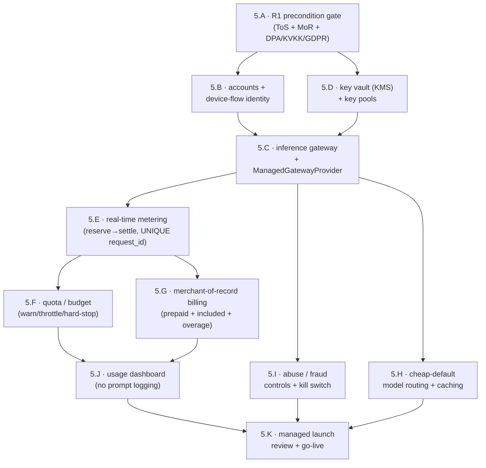

# Phase 5 — Managed inference (the revenue beachhead)

> Status: Not started — **PRODUCT PHASE 2**, the **first** Phase-2 deliverable. Hard-gated on all of Product Phase 1 (Phases 0–4) shipped + battle-tested, **and** on the R1 provider-ToS / merchant-of-record / compliance precondition gate. Decoupled from and **ahead of** cloud execution ([phase-6-cloud-execution-portal.md](phase-6-cloud-execution-portal.md)).

- **Related**: [phase-4-vscode.md](phase-4-vscode.md) (prior phase, closes Product Phase 1), [phase-6-cloud-execution-portal.md](phase-6-cloud-execution-portal.md) (the other Phase-2 deliverable), [../README.md](../README.md), [../../architecture/managed-inference.md](../../architecture/managed-inference.md), [../../architecture/multi-llm-providers.md](../../architecture/multi-llm-providers.md), [../../architecture/local-first-and-security.md](../../architecture/local-first-and-security.md), [../../reference/shared-core/llm-provider-seam.md](../../reference/shared-core/llm-provider-seam.md), [../../reference/portal/api-reference.md](../../reference/portal/api-reference.md), [../../reference/contracts/sse-event-schema.md](../../reference/contracts/sse-event-schema.md), [../../reference/desktop/database-schema.md](../../reference/desktop/database-schema.md), [../../decisions/0012-managed-inference-dual-mode.md](../../decisions/0012-managed-inference-dual-mode.md), [../../decisions/0013-managed-key-vault-and-pools.md](../../decisions/0013-managed-key-vault-and-pools.md), [../../decisions/0014-managed-metering-quota-and-billing.md](../../decisions/0014-managed-metering-quota-and-billing.md), [../../decisions/0015-managed-mode-data-handling-and-compliance.md](../../decisions/0015-managed-mode-data-handling-and-compliance.md), [../../decisions/0011-internal-llm-abstraction.md](../../decisions/0011-internal-llm-abstraction.md), [../../decisions/0006-os-keychain-for-api-keys.md](../../decisions/0006-os-keychain-for-api-keys.md), [../../decisions/0008-local-first-phase-1-cloud-phase-2.md](../../decisions/0008-local-first-phase-1-cloud-phase-2.md), [../../analysis/managed-inference-business-model-2026-06-03.md](../../analysis/managed-inference-business-model-2026-06-03.md)

> **Everything in this phase is Product Phase 2.** Managed inference is added as an
> **opt-in convenience mode** — never a replacement for, and never a silent crossing
> from, BYOK. BYOK-local stays first-class and permanently non-degraded
> ([ADR-0012](../../decisions/0012-managed-inference-dual-mode.md)). This is the
> **first** Phase-2 deliverable: a **thin inference gateway** that ships **ahead of
> and decoupled from** the heavy cloud-execution plane
> ([phase-6-cloud-execution-portal.md](phase-6-cloud-execution-portal.md)). The
> engine keeps running **locally**; only LLM egress is proxied — managed *inference*
> is not managed *execution* ([ADR-0012](../../decisions/0012-managed-inference-dual-mode.md)).

## Goal

Add **managed inference** as the opt-in `managed` execution mode: a thin gateway
where the engine (`@relavium/core`) still runs on the user's machine and only LLM
egress is proxied through **`gateway.relavium.com`**, calling providers with
**Relavium's own keys** and selling metered usage by license tier. This is the
**revenue beachhead** — Phase-2 income arrives early, behind the existing
`LLMProvider` seam, without putting inference on the engine's critical path and
without the heavy worker/queue/portal machinery of cloud execution
([ADR-0012](../../decisions/0012-managed-inference-dual-mode.md),
[managed-inference.md](../../architecture/managed-inference.md)). Architecturally
it is a new **`ManagedGatewayProvider`** behind the *same immovable* seam
([ADR-0011](../../decisions/0011-internal-llm-abstraction.md)); `@relavium/core`
and the seam *types* do not change. Commercially it is priced as **prepaid credits
+ a hard included-usage cap + metered overage + cheap-default model routing** —
never a flat $20-for-$15 pass-through ([ADR-0014](../../decisions/0014-managed-metering-quota-and-billing.md)).
It is built **only after** the R1 precondition gate (provider ToS + merchant-of-record
+ DPA/KVKK/GDPR posture) clears.

## Outcomes (Definition of Done)

- A new **`ManagedGatewayProvider`** is selected by `executionMode = 'managed'`
  behind the unchanged `LLMProvider` seam; `@relavium/core` and the seam types are
  untouched, and BYOK (`local`) remains the default.
- **`gateway.relavium.com`** proxies LLM calls only — the engine runs locally; no
  workflow execution, checkpoint, or run state leaves the machine in managed mode.
- **Accounts + device-flow identity**: a user signs in (RFC 8628 device flow) and
  the engine picks up managed mode from the token; **no silent mode crossing**.
- A **key vault (KMS) + per-provider key pools** hold Relavium's own provider keys,
  with rotation and 429-cooldown failover ([ADR-0013](../../decisions/0013-managed-key-vault-and-pools.md)).
- **Real-time metering** is idempotent (reserve→settle keyed on a **UNIQUE
  `request_id`**) and reconciled nightly against provider invoices; each
  `usage_event` records both `provider_cost` (COGS) and `billed_cost` (margin).
- **Quota / budget enforcement** (warn → throttle → hard-stop; per-user/day caps)
  is on by default and bounds runaway spend.
- **Merchant-of-record billing (prepaid + overage)** runs prepaid credits + included
  usage + metered overage (the MoR is the primary rail; a direct Stripe integration is
  the mutually-exclusive alternative — [ADR-0014](../../decisions/0014-managed-metering-quota-and-billing.md));
  the **usage dashboard** shows credits, included usage, overage, and per-day budget.
- **Cheap-default model routing**, **abuse/fraud controls**, and **no prompt logging
  by default** (meter token counts, not content) are all on by default.
- **BYOK is unchanged and still first-class** — managed never deprecates it, and the
  heavy-user pressure valve (BYOK-unlimited) remains available
  ([ADR-0012](../../decisions/0012-managed-inference-dual-mode.md)).

## Scope

### In scope (all Product Phase 2)

- **The R1 precondition gate** (5.A): per-provider written ToS confirmation /
  commercial-or-partner agreement, a **merchant-of-record**, a DPA + sub-processor
  list, a KVKK+GDPR + data-residency posture, and a SOC 2 trajectory — all clearing
  **before** any managed code ships ([ADR-0012](../../decisions/0012-managed-inference-dual-mode.md),
  [ADR-0015](../../decisions/0015-managed-mode-data-handling-and-compliance.md)).
- **Accounts + device-flow identity** (5.B): minimal account/identity service and
  **OAuth Device Flow (RFC 8628)** login on the surfaces; the engine reads the token
  to imply `managed` mode.
- **The inference gateway** (5.C): `gateway.relavium.com` proxying `generate`/`stream`
  for the `managed` mode behind the seam, plus the **`ManagedGatewayProvider`** client
  the engine selects locally ([managed-inference.md](../../architecture/managed-inference.md)).
- **Key vault (KMS) + key pools** (5.D): encrypted store for Relavium's own provider
  keys; multi-key pools per provider for org rate limits, zero-downtime rotation,
  429-cooldown + cross-provider fallback ([ADR-0013](../../decisions/0013-managed-key-vault-and-pools.md)).
- **Real-time metering** (5.E): streaming usage capture (force `include_usage`,
  estimate on interruption), idempotent **reserve→settle** keyed on a UNIQUE
  `request_id`, and **nightly reconciliation** vs provider invoices
  ([ADR-0014](../../decisions/0014-managed-metering-quota-and-billing.md)).
- **Quota / budget enforcement** (5.F): warn / throttle / hard-stop, included-usage
  hard cap, and per-user/day budget caps, enforced at reserve time and mid-stream.
- **Merchant-of-record billing (prepaid + overage)** (5.G): prepaid credits + included
  usage + metered overage at roughly cost×1.3, with the merchant-of-record (primary
  rail) absorbing VAT/sales-tax/chargebacks; a direct Stripe integration is the
  mutually-exclusive alternative ([ADR-0014](../../decisions/0014-managed-metering-quota-and-billing.md)).
- **Cheap-default model routing** (5.H): a cheap default lane + prompt caching to
  hold token COGS down (≈ −46% per the analysis), gating expensive frontier models.
- **Abuse / fraud controls** (5.I): AUP enforcement, anomaly cutoff, per-account caps,
  and a kill switch to protect Relavium's provider account from key-ban at scale.
- **The usage dashboard** (5.J): credits, included usage, overage, per-day budget,
  and **no-prompt-logging-by-default** transparency.

### Explicitly out of scope (even within Phase 2)

- **Cloud execution.** The engine stays **local** in managed mode; BullMQ/Redis
  cloud workers, the web portal canvas, team workspaces, and enterprise (SSO/audit/
  SOC2/data-residency) are [phase-6-cloud-execution-portal.md](phase-6-cloud-execution-portal.md),
  decoupled from this phase. Managed inference does **not** depend on Phase 6.
- **Deprecating or degrading BYOK.** BYOK-local stays first-class and the default;
  managed is purely additive ([ADR-0012](../../decisions/0012-managed-inference-dual-mode.md)).
- **Silent mode crossing.** A user in BYOK never silently becomes a managed (billed)
  user; managed is explicit and token-gated, and an unreachable gateway raises an
  explicit error rather than falling back to a user key.
- **Prompt logging.** Managed mode meters **token counts, not content**; prompt/
  completion bodies are not logged by default ([ADR-0015](../../decisions/0015-managed-mode-data-handling-and-compliance.md)).
- **Changing `@relavium/core` or the seam types.** Managed is a new provider
  implementation behind the existing seam only ([ADR-0011](../../decisions/0011-internal-llm-abstraction.md)).
- **A full control-plane portal / RBAC / org model** — the usage dashboard here is a
  thin account/usage view; team workspaces and RBAC are Phase 6.

## Work breakdown

Ordered workstreams. The **R1 gate (5.A) blocks everything** — no managed code
ships until it clears. After the gate, identity (5.B) and the gateway+vault
(5.C, 5.D) are the critical path; metering (5.E) underpins quota (5.F) and billing
(5.G); routing (5.H), abuse (5.I), and the dashboard (5.J) layer on top. The
dependency flow:

### 5.A — R1 precondition gate (ToS, merchant-of-record, compliance) *(launch-blocking)*

The non-negotiable go/no-go before any managed code. Getting this wrong at scale is
account termination, not a fine ([ADR-0012](../../decisions/0012-managed-inference-dual-mode.md),
[ADR-0015](../../decisions/0015-managed-mode-data-handling-and-compliance.md)).

**Tasks:**
- Obtain, **per provider**, written ToS confirmation or the appropriate
  commercial/partner agreement that "Relavium holds the key, customers consume
  metered usage under Relavium's account, Relavium keeps margin" is permitted
  (Anthropic commercial agreement, OpenAI Scale/enterprise, Google Vertex/reseller
  program, DeepSeek opt-in/non-China-hosted disclosure) — record each.
- Adopt a **merchant-of-record** (e.g. Paddle / Lemon Squeezy) to absorb VAT/sales-tax
  across jurisdictions and chargebacks; wire it as the billing front (5.G).
- Stand up the **DPA + published sub-processor list** (providers become Relavium's
  sub-processors) and the **KVKK + GDPR + data-residency** posture for a
  Turkey-based founder with cross-border transfer ([ADR-0015](../../decisions/0015-managed-mode-data-handling-and-compliance.md)).
- Record the **SOC 2 Type II trajectory** required for the enterprise path (delivered
  later in Phase 6, but the posture is committed here).
- Reconcile the documented tier philosophy ("gate on scale not capability; local free
  forever") into the **included-usage + overage + BYOK-unlimited** tier model before
  any billing work begins ([ADR-0014](../../decisions/0014-managed-metering-quota-and-billing.md),
  [api-reference.md](../../reference/portal/api-reference.md#licensing-tiers)).

**Acceptance:** every provider's permission is confirmed in writing; a
merchant-of-record contract is in place; the DPA/sub-processor list and the
KVKK/GDPR/data-residency posture are recorded; the tier model is reconciled. **No
managed workstream begins until this gate is documented as met.**

### 5.B — Accounts and device-flow identity *(critical path)*

The minimal identity layer so a user can opt in to managed mode and the engine can
pick it up — no full org/RBAC model (that is Phase 6).

**Tasks:**
- Stand up a minimal account/identity service (email+password MVP) and a user record
  keyed for metering, quota, and billing; no team/org model beyond a single billing
  account this phase.
- Implement **OAuth Device Flow (RFC 8628)** for the surfaces (CLI/desktop/VS Code),
  per the [auth section](../../reference/portal/api-reference.md#authentication);
  store the access token in the OS keychain / `SecretStorage`, never plaintext.
- Wire `relavium auth login` (device flow, ~10s) so the engine sets a managed-auth
  token, which the provider factory reads to select the `ManagedGatewayProvider`
  (managed mode) — explicitly, never as a silent default over BYOK.
- Enforce the **no-silent-mode-crossing** rule: a signed-in managed user still runs
  BYOK by default unless managed is explicitly selected; switching to managed is a
  visible, consented action.

**Acceptance:** a user signs up, logs in via device flow from a surface, and the
engine selects `managed` mode from the token only when managed is explicitly chosen;
a BYOK user is never silently billed; the token lives only in the keychain.

### 5.C — Inference gateway + `ManagedGatewayProvider` *(critical path)*

The thin proxy and its client — the load-bearing piece that proves "engine stays
local, only egress is proxied" behind the seam.

**Tasks:**
- Build `gateway.relavium.com` to proxy `generate`/`stream` for managed requests:
  authenticate the managed token (5.B), select a provider key from the pool (5.D),
  forward to the upstream provider, and stream the response back unchanged.
- Implement the **`ManagedGatewayProvider`** in `@relavium/llm` as a new
  `LLMProvider` over the gateway, selected by the factory on
  `executionMode = 'managed'` — **no vendor SDK type crosses the seam**, and
  `@relavium/core` and the seam types do not change
  ([ADR-0011](../../decisions/0011-internal-llm-abstraction.md),
  [managed-inference.md](../../architecture/managed-inference.md)).
- Pass the canonical `LlmRequest` to the gateway and return the canonical
  `StreamChunk` / `LlmResult` / normalized `Usage` so the engine sees managed mode as
  just another provider; the engine, checkpointing, and run state stay **local**.
- Carry a per-request **UNIQUE `request_id`** end-to-end (client → gateway → meter)
  so metering (5.E) is idempotent across retries and reconnects.
- Enforce the seam boundary: the gateway is the only path that touches Relavium's
  keys; surfaces and `@relavium/core` never see a managed key (mirrors the BYOK
  secret rule, [local-first-and-security.md](../../architecture/local-first-and-security.md)).
- Gateway health/error reporting is **secret-free by classification**: an upstream or
  probe failure maps to a closed category + actionable hint — never a raw exception
  string or a URL that may carry credentials — and multi-provider health checks run
  under a deadline hierarchy (per-probe, per-provider, overall ceiling) so one hung
  upstream cannot stall the health surface.

**Acceptance:** a workflow runs end-to-end in `managed` mode with the engine still
local and only LLM egress proxied; the `ManagedGatewayProvider` returns the
identical canonical `Usage`/`StreamChunk` shapes as a BYOK adapter; the import-zone
lint confirms no vendor type and no managed key crosses the seam; the same workflow
in `local` mode is byte-identical in behavior.

### 5.D — Key vault (KMS) + per-provider key pools *(critical path)*

Where Relavium's own provider keys live and how the gateway draws from them safely
([ADR-0013](../../decisions/0013-managed-key-vault-and-pools.md)).

**Tasks:**
- Build a **KMS-backed key vault** for Relavium's own provider keys; keys are read at
  call time inside the gateway and **never** serialized into logs, metering rows, or
  client-facing payloads (extends the never-reinvent-security-primitives rule).
- Implement **per-provider key pools**: multiple keys per provider to spread org rate
  limits, with selection, **zero-downtime rotation**, and a **429-cooldown** that
  parks a saturated key and advances to the next. Pool retry discipline mirrors the
  seam's fallback rules (1.K): transient errors back off with jitter, while an
  **auth-class failure on a pooled key is never blindly retried** — it parks the key
  for investigation (possible revocation) and advances, since a deterministic auth
  failure only repeats.
- Add **cross-provider fallback** for the managed lane (consistent with the BYOK
  `FallbackChain` policy, but over Relavium's pooled keys) so a provider outage
  degrades gracefully.
- Segregate keys per provider/region to bound abuse blast radius (an abuser cannot
  take down all of Relavium's keys at once — see 5.I).
- Add the master-key-compromise incident path hook (the runbook is created with the
  compliance work; the kill switch is wired in 5.I).

**Acceptance:** the gateway resolves a pooled key per managed request with no key in
any log/metering row; a 429 on one key cools it down and the next key serves the
request without user-visible failure; a key rotation completes with zero dropped
requests; key segregation is verified per provider.

### 5.E — Real-time metering (reserve→settle, UNIQUE `request_id`) *(critical path)*

The accounting spine: capture usage accurately and idempotently, and reconcile it
against the truth ([ADR-0014](../../decisions/0014-managed-metering-quota-and-billing.md)).

**Tasks:**
- Implement **streaming usage capture**: force `include_usage` on every managed
  request, fold the provider's final usage chunk into a normalized `Usage`, and
  **estimate on interruption** (a dropped stream still meters a defensible token
  count).
- Implement **idempotent reserve→settle** keyed on the **UNIQUE `request_id`** (5.C):
  reserve an estimated cost before the call, settle the actual cost on completion; a
  duplicate `request_id` never double-charges.
- Persist a `usage_event` per request storing **both** `provider_cost` (COGS) and
  `billed_cost` (the margin-observable), plus model, token counts, and `request_id`.
- Implement **nightly reconciliation**: compare aggregated `usage_event` COGS against
  each provider's invoice/usage export and flag drift for review.
- Price every managed request from **Relavium's own pricing table**, never a provider
  response field (consistent with the Phase-1 cost model and `CostTracker`).

**Acceptance:** a streamed managed request records a `usage_event` with both
`provider_cost` and `billed_cost`; replaying the same `request_id` does not
double-charge; an interrupted stream still meters an estimate; the nightly job
reconciles a day's usage against a provider invoice and reports drift within
tolerance.

### 5.F — Quota and budget enforcement (warn / throttle / hard-stop)

The margin guardrails that make managed mode viable — without them the base case is
~13% gross and a single whale loses money ([ADR-0012](../../decisions/0012-managed-inference-dual-mode.md),
[ADR-0014](../../decisions/0014-managed-metering-quota-and-billing.md)).

**Tasks:**
- Enforce the **hard included-usage cap** at reserve time: once a user exhausts
  included usage (and prepaid credits), managed requests are gated to the configured
  enforcement action; **BYOK is never gated** (users pay their own bills).
- Implement the enforcement ladder — **warn (80%) → throttle → hard-stop (100%)** —
  at submission **and mid-stream**, so a runaway loop is stopped, not just flagged.
- Implement a **per-user/day budget cap** (e.g. $5/day) that turns a runaway loop
  from a −$5,000 event into a −$150 event (per the analysis).
- Surface the live quota/budget state to the metering and dashboard layers (5.E,
  5.J) and to the surfaces so a user sees remaining included usage/credits.
- Always offer the **BYOK pressure valve**: a capped managed user can switch to BYOK
  (their own key, unlimited) explicitly — never auto-crossed.

**Acceptance:** a user crossing 80% gets a warn, throttle engages, and a hard-stop
fires at 100% on the next reserve and mid-stream; a per-day budget caps a runaway
loop within the day's limit; BYOK requests are never gated; switching to BYOK is
explicit.

### 5.G — Merchant-of-record billing (prepaid credits + included usage + overage)

The commercial mechanics, run through the **merchant-of-record as the primary rail**
so margin is real and tax/chargebacks are absorbed; a direct **Stripe** integration is
the mutually-exclusive **alternative** rail, used only if not going through an MoR
(never layered) ([ADR-0014](../../decisions/0014-managed-metering-quota-and-billing.md)).

**Tasks:**
- Integrate the **merchant-of-record** (5.A) as the primary billing rail — or **Stripe**
  directly as the alternative if no MoR — for **prepaid credits** (a positive float so
  revenue precedes COGS), an **included-usage** allotment per tier, and **metered
  overage** billed at roughly **cost×1.3** — never a flat $20-for-$15 pass-through.
- Wire credit purchase, balance draw-down (from settled `usage_event`s, 5.E), and
  overage invoicing; the merchant-of-record handles VAT/sales-tax and disputes.
- Implement the reconciled tier entitlements (5.A): Free / Pro / Enterprise included
  usage, overage rate, and per-day caps — gating managed usage only, never BYOK.
- Handle refunds/disputes and a clean dunning/grace path; a failed payment degrades to
  the hard-stop ladder (5.F), never an open-ended provider-COGS exposure.
- Ensure prepaid + caps mean **revenue precedes COGS** (the working-capital guardrail).

**Acceptance:** a user buys prepaid credits, consumes included usage, and is billed
overage at the configured markup; the merchant-of-record settles tax; a failed
payment lands on the hard-stop ladder; balance draw-down matches settled
`usage_event` totals to the micro-cent.

### 5.H — Cheap-default model routing + prompt caching

The COGS lever that keeps the unit economics healthy (≈ −46% token COGS in the
analysis) ([ADR-0012](../../decisions/0012-managed-inference-dual-mode.md)).

**Tasks:**
- Implement a **cheap-default lane**: route the bulk of managed traffic to a cheap
  default model unless the workflow/agent explicitly requests a frontier model, so
  expensive models are gated by the included-usage pool (5.F).
- Enable **prompt caching** on by default where the provider supports it (Anthropic
  cache, OpenAI/DeepSeek cached tokens, Gemini), reusing the Phase-1 cache plumbing.
- Make routing transparent and learnable (dollar-denominated, not an opaque quota) so
  managed mode never repeats the Cursor/Copilot "silent devaluation" backlash.
- Keep routing a **managed-mode policy only**; BYOK mode honors the agent's model
  selection exactly (no managed routing crosses into BYOK).
- Evaluate a **dynamic model catalog for the managed lane** (a remote, versioned
  price/limit/capability dataset refreshed out-of-band) so routing and pricing updates
  do not require a client release; BYOK keeps the in-code pricing table as its source
  of truth either way.

**Acceptance:** a managed workflow without an explicit frontier model runs on the
cheap default lane; prompt caching reduces measured token COGS on a cache-friendly
workload; BYOK model selection is unaffected; the routing decision is visible to the
user.

### 5.I — Abuse / fraud controls + kill switch

Protect Relavium's provider account: one abuser must not get all of Relavium's keys
banned ([ADR-0012](../../decisions/0012-managed-inference-dual-mode.md) R3,
[ADR-0015](../../decisions/0015-managed-mode-data-handling-and-compliance.md)).

**Tasks:**
- Enforce an **AUP** at the gateway with content-moderation hooks (abuse runs under
  Relavium's provider account, so policy violations are a key-ban risk).
- Implement **anomaly detection** (sudden spend/volume spikes, signup-fraud signals)
  with per-account caps and automatic throttle/suspend.
- Build a **kill switch** to immediately halt managed traffic (globally, per-provider,
  or per-account) and a per-account suspend, wired to the key segregation in 5.D.
- Add signup/payment-fraud controls at account creation (5.B) so prepaid credits
  cannot be farmed with stolen cards (the merchant-of-record helps here).
- Document the abuse-response and key-pool-saturation runbooks (created with the
  compliance work) so on-call has a procedure.

**Acceptance:** an abusive account is detected and suspended without affecting other
users; the kill switch halts managed traffic per scope on demand; key segregation
limits a ban to one provider/region; BYOK users are wholly unaffected by any managed
abuse response.

### 5.J — Usage dashboard (no prompt logging by default)

The transparency surface — a thin account/usage view, not the Phase-6 control-plane
portal ([ADR-0015](../../decisions/0015-managed-mode-data-handling-and-compliance.md)).

**Tasks:**
- Build a minimal usage dashboard (account scope): prepaid credit balance, included
  usage consumed, overage to date, and the per-day budget — fed by settled
  `usage_event`s (5.E) and the billing balance (5.G).
- Show **dollar-denominated, learnable** usage (never an opaque quota), with the model
  routing decisions (5.H) and remaining included usage visible.
- Enforce and surface **no prompt logging by default**: the dashboard shows token
  counts and cost, **never** prompt/completion content; document the meter-not-content
  posture ([ADR-0015](../../decisions/0015-managed-mode-data-handling-and-compliance.md)).
- Reuse `packages/ui` where it is a thin usage view; this is **not** a second canvas
  and **not** the Phase-6 portal.
- Surface the BYOK pressure-valve affordance ("switch to your own key — unlimited")
  consistent with the no-silent-crossing rule.

**Acceptance:** a managed user sees their credit balance, included usage, overage,
and per-day budget that match the settled `usage_event` and billing totals; no
prompt/completion content is shown or logged; the BYOK switch is one explicit click.

### 5.K — Managed launch review and go-live

The pre-ship gate for the new billing + data-path surface; nothing launches until it
passes (the security counterpart for managed mode).

**Tasks:**
- Confirm the **R1 gate (5.A)** is still satisfied at launch (agreements, MoR, DPA,
  KVKK/GDPR posture) and that the no-prompt-logging default is verified in production
  config ([ADR-0015](../../decisions/0015-managed-mode-data-handling-and-compliance.md)).
- Audit the **key-leak surfaces** for managed mode: the at-rest vault, the gateway
  path, metering rows, billing payloads, and the dashboard — no Relavium key ever
  appears in any of them.
- Verify metering idempotency (UNIQUE `request_id`), the nightly reconciliation, and
  the quota ladder (warn/throttle/hard-stop + per-day cap) under load and a forced
  runaway loop.
- Penetration-test the gateway auth, abuse controls, kill switch, and the
  payment/credit-fraud path; run the [security review](../../standards/security-review.md)
  checklist for the managed surface.
- Verify **BYOK-local is regression-green and unchanged**: every Phase-1 surface still
  runs fully locally with no account, and no managed code path crosses into BYOK.

**Acceptance:** the launch review passes with no open high/critical findings across
the managed key-leak surfaces, metering, and quota; BYOK-local is regression-green
and unchanged; managed inference (the `managed` mode) is shipped — achieving **M6**.

## Milestones

In-phase milestones, ordered. **M6** is the global spine milestone for this phase:
*Managed inference shipped — the `managed` mode revenue beachhead, engine still
local, BYOK unchanged*, achieved by `5.C + 5.E + 5.K`.

| # | Milestone | Completed by |
|---|-----------|--------------|
| 5.M1 | R1 precondition gate met (ToS + MoR + DPA/KVKK/GDPR + tier model) | 5.A |
| 5.M2 | Accounts + device-flow identity; engine selects `managed` from a token (no silent crossing) | 5.B |
| 5.M3 | Gateway + `ManagedGatewayProvider` proxy LLM egress behind the seam; engine stays local | 5.C, 5.D |
| 5.M4 | Real-time idempotent metering + nightly reconciliation live | 5.E |
| 5.M5 | Quota/budget enforcement + merchant-of-record prepaid/included/overage billing working | 5.F, 5.G |
| 5.M6 | Cheap-default routing, abuse controls + kill switch, usage dashboard (no prompt logging) | 5.H, 5.I, 5.J |
| **M6** | **Managed inference shipped: `managed` mode behind the seam, engine local, BYOK unchanged** | **5.C, 5.E, 5.K** |

## Dependencies

- **All of Product Phase 1 (Phases 0–4)** shipped and battle-tested by real users —
  the hard gate that starts any Phase-2 work
  ([ADR-0008](../../decisions/0008-local-first-phase-1-cloud-phase-2.md)).
- **The R1 precondition gate (5.A)** — provider ToS confirmation per provider, a
  merchant-of-record, a DPA/sub-processor list, and a KVKK/GDPR/data-residency
  posture — a launch-blocking dependency for everything in this phase
  ([ADR-0012](../../decisions/0012-managed-inference-dual-mode.md),
  [ADR-0015](../../decisions/0015-managed-mode-data-handling-and-compliance.md)).
- The **immovable `LLMProvider` seam** ([ADR-0011](../../decisions/0011-internal-llm-abstraction.md),
  [llm-provider-seam.md](../../reference/shared-core/llm-provider-seam.md)) behind
  which `ManagedGatewayProvider` is added — `@relavium/core` and the seam types do
  not change.
- The Phase-1 **`CostTracker`** + model-pricing model (Relavium's own pricing table,
  micro-cents) reused for metering ([database-schema.md](../../reference/desktop/database-schema.md)).
- The **managed-inference architecture** ([managed-inference.md](../../architecture/managed-inference.md))
  and the four managed ADRs: dual-mode ([0012](../../decisions/0012-managed-inference-dual-mode.md)),
  key vault/pools ([0013](../../decisions/0013-managed-key-vault-and-pools.md)),
  metering/quota/billing ([0014](../../decisions/0014-managed-metering-quota-and-billing.md)),
  data-handling/compliance ([0015](../../decisions/0015-managed-mode-data-handling-and-compliance.md)).
- The **device-flow auth** and tier model from the
  [portal API reference](../../reference/portal/api-reference.md) (the auth and
  licensing sections), reconciled in 5.A.
- **Not dependent on** [phase-6-cloud-execution-portal.md](phase-6-cloud-execution-portal.md):
  managed inference is decoupled from and ships ahead of cloud execution.

## Exit criteria (go / no-go)

All must be true to consider managed inference shipped (**M6**):

1. The **R1 precondition gate** is documented as met: per-provider ToS/commercial
   confirmation, a merchant-of-record, a DPA + sub-processor list, and a
   KVKK/GDPR/data-residency posture.
2. A user logs in via **device flow**, **explicitly** opts into managed mode, and a
   workflow runs in `managed` mode with the **engine still local** and only LLM
   egress proxied through `gateway.relavium.com` — with **no silent mode crossing**
   from BYOK.
3. `managed` is a new **`ManagedGatewayProvider`** behind the unchanged
   `LLMProvider` seam; `@relavium/core` and the seam types are untouched, and no
   vendor type or managed key crosses the seam.
4. **Real-time metering** is idempotent (UNIQUE `request_id`, reserve→settle),
   records both `provider_cost` and `billed_cost`, estimates on interruption, and
   reconciles nightly against provider invoices within tolerance.
5. **Quota/budget enforcement** (warn / throttle / hard-stop + per-user/day cap) and
   the **hard included-usage cap** fire correctly; **merchant-of-record** billing (the
   primary rail; Stripe the mutually-exclusive alternative) runs prepaid credits +
   included usage + metered overage.
6. **Cheap-default routing**, **abuse controls + kill switch**, and **no prompt
   logging by default** are on by default; the **usage dashboard** shows credits,
   included usage, overage, and the per-day budget (token counts, never content).
7. **BYOK is unchanged and first-class**: every Phase-1 surface still runs fully
   locally with no account, managed never deprecates BYOK, and the BYOK-unlimited
   pressure valve is one explicit switch away.

## Risks & mitigations

| Risk | Impact | Mitigation |
|------|--------|------------|
| **Provider ToS bars reselling / proxying (R1)** | Account termination at scale, not a fine | Hard go/no-go gate (5.A): per-provider written confirmation or a commercial/partner agreement **before** any managed code ([ADR-0012](../../decisions/0012-managed-inference-dual-mode.md)). |
| **Margin erosion / whales (adverse selection)** | A flat plan loses money on heavy users (one whale = −$367) | Hard included-usage cap + per-day budget + prepaid credits + cheap-default routing/caching (5.F, 5.G, 5.H); **BYOK as the unlimited pressure valve** ([ADR-0014](../../decisions/0014-managed-metering-quota-and-billing.md)). |
| **Provider key-ban at scale** (one abuser → Relavium account suspended) | Managed mode down for everyone | AUP + anomaly detection + per-account caps + kill switch (5.I); key segregation per provider/region + multi-key pools (5.D). |
| **Trust failure (logging/billing incident)** on a privacy-built brand | Reputational damage, churn | No-prompt-logging-by-default (meter counts, not content); transparent dollar-denominated metering (5.E, 5.J); BYOK escape hatch ([ADR-0015](../../decisions/0015-managed-mode-data-handling-and-compliance.md)). |
| **Tax / DPA / KVKK-GDPR non-compliance** | Launch-blocking legal exposure | Merchant-of-record from day one; DPA + sub-processor list; KVKK/GDPR posture — all in the R1 gate (5.A) and re-verified at launch (5.K). |
| **Silent mode crossing** (BYOK user billed unexpectedly) | Trust breach, surprise charges | Managed is explicit + token-gated (5.B); an unreachable gateway raises an explicit error, never falls back to a user key; BYOK stays the default. |
| **Metering double-charge / drift** | Over-billing or under-collecting COGS | Idempotent reserve→settle keyed on a UNIQUE `request_id` (5.E); nightly reconciliation vs provider invoices flags drift. |
| **Commoditization** (OpenRouter cheaper + transparent) | Managed competes as a token reseller and loses | Managed is a *convenience feature*, not the product — win on orchestration (the intact UVP); BYOK is the higher-margin core ([ADR-0012](../../decisions/0012-managed-inference-dual-mode.md) R6). |
| **Working-capital timing** (COGS before revenue) | Cash-flow risk | Prepaid credits + caps so revenue precedes COGS (5.F, 5.G). |
| **Scope creep into cloud execution** | The thin gateway balloons into the heavy plane, slipping revenue | Engine stays local; cloud workers/portal/enterprise are decoupled in [phase-6-cloud-execution-portal.md](phase-6-cloud-execution-portal.md); managed has no Phase-6 dependency. |
