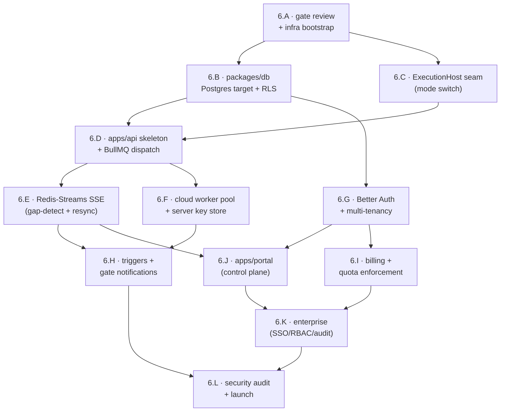

# Phase 6 — Cloud execution and web portal

> Status: Not started — **PRODUCT PHASE 2**, the **second** Phase-2 deliverable (after [phase-5-managed-inference.md](phase-5-managed-inference.md)). Hard-gated on all of Product Phase 1 (Phases 0–4) being shipped and battle-tested by real users.

- **Related**: [phase-5-managed-inference.md](phase-5-managed-inference.md) (prior phase, the first Phase-2 deliverable), [phase-4-vscode.md](phase-4-vscode.md) (closes Product Phase 1), [../README.md](../README.md), [../../architecture/cloud-phase-2.md](../../architecture/cloud-phase-2.md), [../../architecture/managed-inference.md](../../architecture/managed-inference.md), [../../architecture/local-first-and-security.md](../../architecture/local-first-and-security.md), [../../architecture/shared-core-engine.md](../../architecture/shared-core-engine.md), [../../reference/portal/api-reference.md](../../reference/portal/api-reference.md), [../../reference/contracts/sse-event-schema.md](../../reference/contracts/sse-event-schema.md), [../../reference/desktop/database-schema.md](../../reference/desktop/database-schema.md), [../../decisions/0008-local-first-phase-1-cloud-phase-2.md](../../decisions/0008-local-first-phase-1-cloud-phase-2.md), [../../decisions/0012-managed-inference-dual-mode.md](../../decisions/0012-managed-inference-dual-mode.md), [../../decisions/0005-sqlite-drizzle-local-postgres-cloud.md](../../decisions/0005-sqlite-drizzle-local-postgres-cloud.md)

> **Everything in this phase is Product Phase 2.** It must never be mistaken for
> shipped Phase 1 behavior. The cloud layer is added *alongside* — not replacing —
> the local-first surfaces; existing desktop/CLI/extension users keep running
> locally with **no account**. This is the last phase in the roadmap. It is
> **decoupled from and sequenced after** managed inference
> ([phase-5-managed-inference.md](phase-5-managed-inference.md)): managed inference
> proxies only LLM egress with the engine local, whereas this phase adds the heavy
> **cloud-execution** plane (workers running the engine server-side) plus the web
> portal. Cloud may also offer **BYOK-cloud** mode (the user's key, server-side); it
> reuses the Phase-5 managed accounts/identity and billing where applicable, but it
> does **not** block, and is not blocked by, managed inference. **BYOK stays
> first-class** and no mode crosses silently
> ([ADR-0012](../../decisions/0012-managed-inference-dual-mode.md)).

## Goal

Add an optional cloud **execution** layer and a web control-plane portal so teams
can run workflows server-side (24/7 automation, sharing, cloud triggers), manage
usage/quota/licensing, and govern access — with a **transparent local→cloud switch
behind the engine's execution-mode interface**, so the *same* `@relavium/core`
runs in both modes with no fork ([ADR-0008](../../decisions/0008-local-first-phase-1-cloud-phase-2.md)).
This is the **heavy cloud-execution plane**, distinct from and sequenced **after**
the thin managed-inference gateway ([phase-5-managed-inference.md](phase-5-managed-inference.md),
[ADR-0012](../../decisions/0012-managed-inference-dual-mode.md)): there the engine
stayed local and only LLM egress was proxied; here the engine itself runs in cloud
workers. Cloud workers may use **BYOK-cloud** (the user's key in a server-side
store) and/or the Phase-5 managed gateway for LLM egress, but `managed` inference
does not depend on this phase. Build this only after Phase 1 reveals which workflows
users actually share, which triggers they use, and where the engine's real
bottlenecks are.

## Outcomes (Definition of Done)

- A stable **`ExecutionHost` interface** resolves local-vs-cloud once at engine
  creation; surfaces never branch on mode and never change code to run in the cloud.
- **`apps/api`** (Hono on Bun) wraps `@relavium/core` with BullMQ dispatch,
  Postgres 16 state via the same Drizzle schema, and HTTP SSE backed by Redis
  Streams — emitting the canonical `RunEvent` union unchanged.
- **Cloud workers** pull BullMQ jobs and run the unmodified engine in isolated,
  egress-restricted processes; ephemeral storage is wiped on completion.
- **Accounts and multi-tenancy** via Better Auth, with strict `org_id` isolation
  enforced at the data layer (RLS) — not in application code alone.
- **`apps/portal`** (Vite + React + TanStack Router) presents the control plane:
  dashboard, usage, quota, runs, gates, team, audit, settings.
- **Webhook and schedule triggers** are functional; **human-gate notifications**
  go out over email/Slack with idempotent, first-decision-wins resolution.
- **Billing and quota enforcement** (budget alerts, warn/pause/hard-stop) and a
  **passing multi-tenant security audit** of the four key-leak surfaces.
- All Phase 1 surfaces still run fully locally with **no account**, unchanged.

## Scope

### In scope (all Product Phase 2)

- The **engine execution-mode switch** (`ExecutionHost` seam) so local and cloud
  share one engine and one event contract.
- **`apps/api`** — Hono on Bun: run submission, BullMQ dispatch, Redis-Streams SSE
  (`sequenceNumber` gap-detection + `Last-Event-ID` resync per the
  [SSE event schema](../../reference/contracts/sse-event-schema.md)), Postgres 16
  state via Drizzle, multi-tenant auth, gate fulfillment, trigger endpoints.
- **Cloud workers** — BullMQ worker pools (orchestrator / node / system) running
  the same `@relavium/core` + `@relavium/llm` with a server-side AES-256-GCM key
  store and restricted egress.
- **`apps/portal`** — control-plane SPA (usage/quota/license/enterprise: SSO, team
  workspaces, audit), run-replay URLs, org-level cost aggregation + CSV export.
  *Reuses `packages/ui` where it is a control plane, not a second canvas.*
- **Accounts/auth** via Better Auth (email+password MVP; SSO at the Enterprise tier)
  and device-flow login for surfaces.
- **Triggers**: webhook endpoint enqueues a run; cron via BullMQ repeat jobs.
- **Human-gate notifications** via email/Slack; unified gate inbox.
- **Billing/quota enforcement**: budgets, 80%/100% alerts, enforcement actions.
- A `sync to cloud` path on desktop + CLI driven by the engine mode switch.
- A **multi-tenant security review** before ship.

### Explicitly out of scope (even within Phase 2)

- **Rewriting or forking the engine for the cloud.** The API *wraps* the same
  `@relavium/core`; any cloud-only behavior lives behind the `ExecutionHost`
  interface, never in a parallel engine ([ADR-0008](../../decisions/0008-local-first-phase-1-cloud-phase-2.md)).
- **Breaking any Phase 1 surface.** Local-first must keep working with no account.
- **Syncing full LLM transcripts.** The cloud is a control/execution plane, never
  a transcript archive — transcripts stay local (local mode) or in ephemeral
  worker storage wiped on completion (cloud mode).
- **OAuth social providers in the MVP** — email+password for the portal MVP;
  SAML/OIDC SSO is the Enterprise-tier add (workstream 6.K), not the MVP.
- **A shared public workflow marketplace** (later, if ever).
- **Self-hosted / VPC / data-residency deployment** beyond design hooks — an
  Enterprise concern tracked, not delivered, this phase.

## Work breakdown

Ordered workstreams. Each maps to the global spine; ids `6.C`, `6.D`, `6.E`,
`6.G`, `6.J`, `6.K` are on or near the critical path (`6.C → 6.D → 6.E → 6.J`).
The dependency flow:

### 6.A — Phase-2 go-gate review and cloud infra bootstrap

Confirm the hard gate is met and stand up the minimum infrastructure, before any
cloud code. This is a deliberate checkpoint, not a formality.

**Tasks:**
- Verify the [ADR-0008](../../decisions/0008-local-first-phase-1-cloud-phase-2.md)
  gate: all of Phases 0–4 shipped and battle-tested by real users; record the
  evidence (active surfaces, real run volume, the workflows/triggers users
  actually ask for).
- Confirm the engine's hosting boundary is genuinely swappable: the Phase-1
  surfaces already call `WorkflowEngine.start(workflowId, input)` against an interface, with no
  platform-specific imports in `@relavium/core` (the invariant verified since
  Phase 1).
- Provision dev/staging infra: Postgres 16, Redis 7, object storage for large
  run-output artifacts, and a secrets manager for the server-side key store.
- Stand up IaC + CI/CD for `apps/api` and `apps/portal` (build, migrate, deploy),
  and a private staging environment.
- **Reuse the Phase-5 managed foundations where they exist**: the accounts/identity
  (device-flow auth), the billing rail (merchant-of-record primary; Stripe only as the
  mutually-exclusive alternative, per [ADR-0014](../../decisions/0014-managed-metering-quota-and-billing.md)),
  and the reconciled tier model already stood up
  for managed inference ([phase-5-managed-inference.md](phase-5-managed-inference.md))
  carry forward; this phase extends them with the org/team/RBAC model, not from
  scratch. (If cloud ships without managed, reconcile the tier sketches in the
  [portal API reference](../../reference/portal/api-reference.md#licensing-tiers)
  here instead.)

**Acceptance:** the gate is documented as met; staging Postgres/Redis/object-store
are reachable from CI; the tier model is in place (reused from Phase 5 or reconciled
here); no engine fork is required to proceed.

### 6.B — `packages/db`: Postgres target, multi-tenancy, and migrations

Extend the **one Drizzle schema** to target Postgres 16 with tenancy, without
forking the local SQLite model ([ADR-0005](../../decisions/0005-sqlite-drizzle-local-postgres-cloud.md)).

**Tasks:**
- Target the existing `runs` / `run_events` / `run_costs` schema (canonical DDL in
  [database-schema.md](../../reference/desktop/database-schema.md)) at Postgres,
  handling the documented SQLite-vs-Postgres dialect differences in `packages/db`.
- Add the cloud-only tables: `orgs`, `users`, `memberships`, `api_tokens`,
  `quotas`/`budgets`, `audit_events`, and `triggers` (webhook/schedule registry).
- Add `org_id` to every multi-tenant row and enforce **Postgres Row-Level Security**
  so tenancy isolation lives at the data layer, not in app code alone.
- Build the migration toolchain validated against **both** SQLite and Postgres in
  CI; document which dialect each migration targets.
- Define the opt-in local→cloud sync mapping (metadata only — `runId`,
  `workflowId`, status, duration, timestamps, tags; **never** outputs/transcripts)
  per the [sync model](../../reference/portal/api-reference.md#sync-model-opt-in-metadata-only).

**Acceptance:** migrations apply cleanly to a fresh Postgres 16; RLS blocks
cross-`org_id` reads/writes in a test that asserts isolation; the same schema still
builds against SQLite with the Phase-1 surfaces green.

### 6.C — `ExecutionHost` seam: the transparent local→cloud switch *(critical path)*

The load-bearing abstraction: a stable interface around the engine so surfaces
never branch on mode. This precedes the API so the contract is fixed first.

**Tasks:**
- Define `ExecutionHost` (the hosting boundary) with `LocalExecutionHost`
  (in-process worker threads, OS keychain, local SQLite) and `CloudExecutionHost`
  (thin client over `apps/api`) as the two implementations.
- Resolve mode **once at engine creation**, in the documented order: explicit
  `executionMode` override → valid cloud auth token → stored preference →
  default `local` (see
  [cloud-phase-2.md](../../architecture/cloud-phase-2.md#the-transparent-localcloud-switch)).
- Guarantee both hosts emit the **identical** `RunEvent` union from the same
  `RunEventBus`; only the transport differs (in-process/IPC vs HTTP SSE). Add a
  parity test asserting event shape equality across hosts.
- Enforce the two non-negotiable safety rules: **never silently fall back from
  cloud to local** (raise an explicit error suggesting a switch), and **never sync
  full transcripts** in any mode.
- Keep all cloud-specific behavior behind this seam; add an import-zone lint so
  cloud concerns cannot leak into `@relavium/core`.

**Acceptance:** the same workflow runs via `LocalExecutionHost` and (against
staging) `CloudExecutionHost` with byte-identical `RunEvent` types and no surface
code change; the no-silent-fallback and no-transcript-sync rules are covered by tests.

### 6.D — `apps/api` skeleton + BullMQ dispatch *(critical path)*

The Hono-on-Bun API that enqueues — never re-implements — execution.

**Tasks:**
- Scaffold `apps/api` (Hono on Bun) with health, config, and a typed router;
  wire it to Postgres (via `packages/db`) and Redis.
- Implement run submission: `POST /runs` accepts `workflow + inputs + identity`,
  persists run state, enqueues a BullMQ job, returns a `runId`; `GET /runs/{runId}`
  returns current state, outputs, and an events replay (per the
  [cloud execution endpoints](../../reference/portal/api-reference.md#cloud-execution-endpoints-phase-2-data-plane)).
- Define the BullMQ queues and job payloads for the **orchestrator / node / system**
  worker pools; add the **lint rule that bans serializing any provider key into a
  job payload**.
- Add a Redis sliding-window rate limiter and per-org concurrency caps.
- Enforce auth + `org_id` scoping on every route (full auth lands in 6.G; stub the
  identity middleware here so routes are tenancy-scoped from day one).

**Acceptance:** a `POST /runs` from `CloudExecutionHost` enqueues a job whose
payload carries no secrets; `GET /runs/{runId}` reflects the queued/running state;
all routes reject requests outside the caller's `org_id`.

### 6.E — Redis-Streams SSE transport (gap-detection + resync) *(critical path)*

Deliver the canonical event stream over HTTP SSE with lossless reconnection — the
parity-defining piece versus local IPC.

**Tasks:**
- Workers publish each `RunEvent` to a per-run Redis Stream; `GET /runs/{runId}/events`
  serves `text/event-stream`, mapping the SSE `id:` field to `sequenceNumber`.
- Implement reconnection: `Last-Event-ID` resumes the stream; a `sequenceNumber`
  jump triggers a full resync via `GET /runs/{runId}/state` against durable Postgres
  state (per the [SSE schema](../../reference/contracts/sse-event-schema.md#phase-2--cloud-http-sse)).
- Match the documented client `SseManager`: singleton `EventSource` lifecycle with
  exponential-backoff reconnect (500ms → 1s → 2s → 4s, cap 30s).
- Confirm `agent:tool_call.toolInput` is sanitized and `agent:tool_result.outputSummary`
  truncated over SSE exactly as over IPC; no secret ever appears in a stream frame.
- Add a chaos test: kill the connection mid-run and assert zero lost/duplicated
  events after resync.

**Acceptance:** a long run streamed over SSE survives forced disconnects with
lossless reconnection (gap-detect + resync); the delivered event sequence is
identical to the same workflow run locally over IPC.

### 6.F — Cloud worker pool + server-side key store

Worker processes that run the unmodified engine in isolation with cloud key handling.

**Tasks:**
- Build the BullMQ worker that pulls jobs and invokes the **same** `@relavium/core`
  + `@relavium/llm` (one worker thread per agent node, mirroring local execution).
- Implement the server-side **AES-256-GCM** key store replacing the OS keychain for
  cloud runs; keys are read at call time inside the worker and **never** serialized
  into job/checkpoint/log/event data.
- Isolate workers: egress restricted to allowed LLM providers + declared MCP
  servers; ephemeral run storage wiped on completion; large outputs to object storage.
- Wire checkpoint/resume to Postgres so a paused (human-gate) run survives worker
  recycling and resumes on any worker.
- Add per-worker resource limits and graceful drain for deploys.

**Acceptance:** a multi-node workflow completes on the worker pool using the
encrypted key store with no key in any payload/log; a run paused at a human gate
resumes on a *different* worker; egress to a non-allowed host is blocked.

### 6.G — Accounts, Better Auth, and multi-tenancy *(critical path)*

Identity and tenancy — the foundation for the portal, billing, and enterprise.

**Tasks:**
- Integrate **Better Auth v1** (Drizzle adapter) with email+password for the MVP;
  model `orgs`, `users`, `memberships`, and roles (viewer / runner / editor / admin).
- Implement **OAuth Device Flow (RFC 8628)** for interactive surfaces and long-lived
  **API tokens** for CI/CD, per the
  [auth section](../../reference/portal/api-reference.md#authentication); store
  access tokens in the OS keychain on surfaces, never in plaintext files.
- Replace the 6.D identity stub: every route and queue consumer enforces `org_id`
  scoping against the authenticated principal, backed by the 6.B RLS.
- Wire `relavium auth login` (device flow, ~10s) and `--with-token` (CI) into the
  CLI; the engine sets `cloudAuthToken`, which the mode switch (6.C) reads to imply
  cloud mode; refresh happens transparently before API calls.
- Tenancy isolation tests: a member of org A can never see org B's runs, gates,
  usage, or tokens — through the API *and* directly at the DB layer.

**Acceptance:** a user signs up, creates an org, logs in via device flow from the
CLI/desktop, and the engine picks up cloud mode from the token with no surface code
change; cross-org access is provably impossible via API and DB.

### 6.H — Triggers and human-gate notifications

Make always-on triggers and out-of-band gate delivery work — capabilities that only
exist with a server.

**Tasks:**
- **Webhook triggers**: an authenticated endpoint validates the payload and enqueues
  a run; signature verification + per-trigger rate limits.
- **Schedule triggers**: cron via BullMQ repeat jobs, registered in the `triggers`
  table; pause/resume/inspect from the portal (design from
  [ideas/scheduled-and-webhook-triggers.md](../../ideas/scheduled-and-webhook-triggers.md)).
- **Gate notifications**: on `human_gate:paused`, fan out email/Slack to the assignee
  with a deep link; the unified gate inbox lists pending gates across surfaces.
- Gate fulfillment is **idempotent — first valid decision wins** across any channel
  (`POST /runs/{runId}/gates/{gateId}/decide`); a decision emits `human_gate:resumed`
  and the run continues; `timeout_action` maps to `decidedBy: 'timeout_escalation'`.
- Notifications carry **no transcript content** — only metadata + the decision link.

**Acceptance:** a scheduled run fires on cron; a webhook enqueues a run; a paused
gate emails a deep link and approving it (from email or portal) resumes the run
exactly once even if two channels respond concurrently.

### 6.I — Billing and quota enforcement

Org-level cost governance built on usage telemetry — the commercial spine of Phase 2.

**Tasks:**
- Aggregate per-node cost (`cost:updated`) into org-level usage rolled up by model /
  workflow / agent over date ranges; expose query + CSV export.
- Implement budgets with **80% / 100% alert thresholds** and enforcement actions —
  **warn / pause / hard-stop** — per the
  [quota area](../../reference/portal/api-reference.md#intended-api-surface) (Pro+).
- Enforce quota at submission and mid-run: a hard-stop org cannot enqueue or
  continue cloud runs once over budget; local runs are never gated (users pay their
  own LLM bills).
- Integrate the reconciled tier model (6.A): Free / Pro / Enterprise entitlements
  gate cloud run-hours, history retention, and notifications.
- Pricing is always from Relavium's own pricing table, never the provider response
  (consistent with the Phase-1 cost model).

**Acceptance:** an org crossing its budget receives an 80% alert, then a 100% alert,
then the configured enforcement action fires on the next cloud submission; usage and
cost export to CSV match the per-run `cost:updated` totals.

### 6.J — `apps/portal`: the control-plane SPA *(critical path · M7)*

The browser control plane — **not** a second execution engine or a new canvas.

**Tasks:**
- Scaffold `apps/portal` (Vite + React 19 + TanStack Router — not Next.js, per
  [ADR-0002](../../decisions/0002-vite-react-tanstack-not-nextjs.md)); reuse
  `packages/ui` for shared components.
- Build the control-plane pages from the
  [portal pages](../../reference/portal/api-reference.md#portal-pages) list:
  `/dashboard`, `/usage`, `/quota`, `/runs`, `/gates`, `/team`, `/audit`,
  `/settings/auth`.
- Implement **run-replay URLs**: open a run by id, stream live `RunEvent`s over SSE
  (6.E), or replay a finished run from durable state — the same per-node status map
  and cost waterfall the desktop renders.
- Wire usage/quota dashboards, the gate inbox (decide from the browser), and
  org-level cost aggregation + CSV export to the 6.I/6.D APIs.
- Keep the browser out of the data path: it **never** calls LLM providers directly —
  all cloud LLM calls go through workers, so no key ever appears in a network tab.

**Acceptance:** a team member logs in, watches a live cloud run replay over SSE,
shares a run-replay URL a teammate can open, decides a pending gate from the
browser, and views usage-vs-quota — with no provider key visible in any network tab.

### 6.K — Enterprise: SSO, team workspaces/RBAC, and audit *(M7)*

The Enterprise tier on top of the MVP — gated by tier, additive to the portal.

**Tasks:**
- Add **SAML / OIDC SSO** as the Enterprise auth path (the MVP stays
  email+password); device flow routes through the corporate IdP.
- Team workspaces + **RBAC** (viewer / runner / editor / admin), invites, and a
  shared agent/template library scoped per org.
- **SOC 2-style immutable audit log** (`audit_events`): who ran what, who fulfilled
  which gate, membership/role changes; filter + CSV/JSON export for SIEM.
- Enforced quota and retention policies at the Enterprise tier; design hooks (not
  delivery) for self-hosted portal / VPC peering / data residency.
- Audit and RBAC checks are enforced server-side at the data layer, consistent with
  the 6.B RLS and 6.G tenancy model.

**Acceptance:** an Enterprise org logs in via SSO, an admin assigns roles that
visibly gate actions, and every privileged action lands in an immutable, exportable
audit log.

### 6.L — Multi-tenant security audit and launch

The pre-ship gate targeting the new attack surface; nothing launches until it passes.

**Tasks:**
- Audit the **four key-leak surfaces** named in
  [cloud-phase-2.md](../../architecture/cloud-phase-2.md#key-security-note-for-phase-2):
  the at-rest key store, job payloads, exported YAML, and the browser network tab.
- Verify tenancy isolation end-to-end (API + RLS + queues + SSE streams) and that
  cross-org access is impossible at every layer.
- Confirm the load-bearing privacy guarantee: **full LLM transcripts are never
  synced** in any tier or mode (local or cloud).
- Penetration-test webhook/trigger endpoints, rate limits, token revocation, and
  quota-bypass / cost-abuse vectors; run the
  [security review](../../standards/security-review.md) checklist.
- Verify every Phase 1 surface still runs fully locally with no account, unchanged
  (regression gate), then cut the staged production rollout.

**Acceptance:** the security audit passes with no open high/critical findings across
the four leak surfaces and tenancy isolation; Phase 1 local-first regression is
green; Product Phase 2 is shipped.

## Milestones

In-phase milestones, ordered. **M7** is the global spine milestone for this phase:
*Product Phase 2 — cloud execution + portal with transparent local→cloud switch*,
achieved by `6.J + 6.G + 6.K`.

| # | Milestone | Completed by |
|---|-----------|--------------|
| 6.M1 | Gate met; infra + one Drizzle schema target Postgres with RLS | 6.A, 6.B |
| 6.M2 | `ExecutionHost` seam proven: same engine, identical `RunEvent`s, no fork | 6.C |
| 6.M3 | Cloud engine end-to-end: submit → enqueue → worker run → lossless SSE | 6.D, 6.E, 6.F |
| 6.M4 | Accounts + multi-tenancy live; surfaces pick up cloud mode from a token | 6.G |
| 6.M5 | Triggers + gate notifications + quota enforcement working | 6.H, 6.I |
| **M7** | **Control-plane portal + enterprise: transparent local→cloud, one engine** | **6.J, 6.G, 6.K** |
| 6.M6 | Security audit passed; Phase 1 local-first regression green; cloud execution shipped | 6.L |

## Dependencies

- **All of Product Phase 1 (Phases 0–4)** shipped and battle-tested by real users —
  the hard gate that starts this phase ([ADR-0008](../../decisions/0008-local-first-phase-1-cloud-phase-2.md)).
- The engine's clean hosting boundary (`WorkflowEngine.start()` against an interface, zero
  platform-specific imports in `@relavium/core`), designed in Phase 1 and exercised
  locally through Phase 4.
- The canonical **`RunEvent` union** ([sse-event-schema.md](../../reference/contracts/sse-event-schema.md))
  with `sequenceNumber` gap-detection — the same contract both transports emit.
- The **one Drizzle schema** and the SQLite↔Postgres dual-DB strategy
  ([ADR-0005](../../decisions/0005-sqlite-drizzle-local-postgres-cloud.md),
  [database-schema.md](../../reference/desktop/database-schema.md)).
- The **portal/control-plane API surface** and tier model
  ([api-reference.md](../../reference/portal/api-reference.md)).
- The cross-cutting **secret-handling rules**
  ([local-first-and-security.md](../../architecture/local-first-and-security.md))
  that carry forward into the server-side key store.

## Exit criteria (go / no-go)

All must be true to consider Product Phase 2 shipped:

1. A team logs in, imports a workflow YAML from git, runs it in the **cloud**,
   shares a run-replay URL, and approves a human gate via an **email link**.
2. The same `@relavium/core` executes the workflow in cloud mode with **no engine
   fork** — local→cloud is a mode flag through `ExecutionHost`, not a divergent
   code path.
3. Cloud SSE delivers the canonical `RunEvent`s with **lossless reconnection**
   (`sequenceNumber` gap-detection + state resync), identical in shape to local IPC.
4. **Multi-tenancy is provably isolated** (API + RLS + queues + SSE) and the
   security audit of the four key-leak surfaces passes with no high/critical findings.
5. Quota enforcement (warn / pause / hard-stop) and budget alerts fire correctly;
   full LLM transcripts are **never** synced in any tier or mode.
6. **All Phase 1 surfaces still run fully locally with no account, unchanged.**

## Risks & mitigations

| Risk | Impact | Mitigation |
|------|--------|------------|
| **Premature cloud build** | Wasted effort on the wrong features | Hard gate (6.A): all of Phase 1 battle-tested first ([ADR-0008](../../decisions/0008-local-first-phase-1-cloud-phase-2.md)); build for the workflows/triggers users actually asked for. |
| **Engine fork pressure** | Two diverging engines, parity drift | All cloud behavior behind the `ExecutionHost` seam (6.C); import-zone lint keeps cloud concerns out of `@relavium/core`; the API wraps the same engine. |
| **Local vs cloud event parity drift** | Surfaces misrender cloud runs | Both transports emit the same `RunEvent` union from the same `RunEventBus`; cross-host parity + SSE chaos tests (6.C, 6.E). |
| **Multi-tenant data leakage** | Cross-org exposure, breach | Tenancy at the data layer (Postgres RLS, 6.B) plus app-level `org_id` scoping; isolation tests at API and DB (6.G); audit gate (6.L). |
| **Provider-key leakage in the cloud** | Credential compromise | AES-256-GCM at rest; lint bans keys in job payloads; keys read at call time only; audit the four leak surfaces before ship (6.F, 6.L). |
| **Silent cloud→local fallback** | Credential leak / bypassed enterprise controls | Engine never silently falls back; an unreachable cloud raises an explicit error suggesting a switch (6.C). |
| **Cost abuse / runaway spend** | Unbounded LLM bills | Per-org concurrency + rate limits (6.D); budgets with warn/pause/hard-stop enforcement at submission and mid-run (6.I). |
