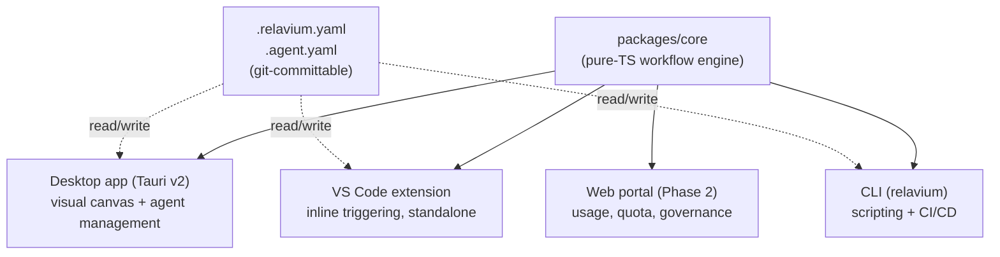

# Relavium — Product Vision

- **Status**: Authoritative
- **Tagline**: Design agents. Ship workflows. Own every run.
- **Related**: [product-constraints.md](product-constraints.md), [uvp.md](uvp.md), [roadmap/README.md](roadmap/README.md)

Relavium is the multi-surface AI agent workflow platform that lets developers
and teams visually design, version-control, and execute multi-model agent
pipelines — from a desktop canvas, VS Code, the CLI, or the cloud — with every
run debuggable, every cost tracked, and every workflow exportable as a
git-friendly YAML file.

## The Problem

Today's AI coding and agent tools force a choice the developer should never have
to make. Chat-driven assistants (Claude Code, Cursor, Cline) are powerful but
every run is ephemeral, single-model, single-agent, and impossible to share or
re-run in CI. Multi-agent frameworks (CrewAI, AutoGen) require Python expertise
and produce no visual or reviewable artifact. General automation builders (n8n,
Zapier) have a visual canvas but no developer-native surfaces and no real
multi-agent AI orchestration. No single tool lets a developer **visually design,
locally execute, and git-commit** a multi-model multi-agent workflow that then
runs identically in their editor, their terminal, and their pipeline.

## The Product

A workflow is the unit of value in Relavium: a directed graph of agent nodes,
control-flow nodes, and human gates, defined as a git-committable YAML file
(`.relavium.yaml`). Agents are likewise YAML files (`.agent.yaml`). The same
pure-TypeScript engine ([packages/core](project-structure.md)) executes that
workflow on whichever surface the user reaches for, so behavior is identical
everywhere. See [tech-stack.md](tech-stack.md) for the engineering decisions
that make this possible.

## The Four Surfaces

| Surface | What it is | What it is *not* |
|---------|-----------|------------------|
| **Desktop app** | Visual workflow canvas and **agent-management center**: design workflows, configure agents, monitor runs, track cost. Built on Tauri v2. | NOT an IDE, NOT a code editor, NOT a terminal. |
| **VS Code extension** | Inline workflow triggering inside the editor (right-click a file → run a workflow), status-bar run monitor, sidebar panels. Bundles the engine — works standalone with no desktop app required. | NOT a replacement for the desktop canvas; code-adjacent work lives here. |
| **CLI** | `relavium run`, `relavium list`, and friends for scripting and CI/CD integration. Fastest path to a first run and the engine's integration-test harness. | NOT a long-running daemon in Phase 1. |
| **Web portal** *(Phase 2)* | Usage metrics, quota, licensing, team governance, enterprise features. A control plane. | NOT where workflows execute — it is not an execution plane. |

The desktop app's scope boundary (management center, not IDE) is a hard
constraint; see [product-constraints.md](product-constraints.md).

## Execution Model

- **Phase 1 — local-first (BYOK-local).** Agents run on the user's machine. In
  this **BYOK-local mode**, LLM API calls leave the user's own machine straight to
  the providers (Anthropic, OpenAI, Gemini, DeepSeek) under the user's own keys;
  nothing transits a Relavium server. On the desktop the authenticated HTTPS call
  is performed by the **Tauri Rust core** (`llm_stream`), so the raw key is read
  from the OS keychain and used only in Rust and never enters the WebView (see
  [architecture/desktop-architecture.md](architecture/desktop-architecture.md));
  on CLI/VS Code the same call is a direct in-process fetch. No cloud dependency,
  no account required, no server to run. In this mode privacy is a guarantee, not
  an add-on — and it stays a permanently-supported, first-class mode in every later
  phase (see [product-constraints.md](product-constraints.md)).
- **Phase 2 — two independent capabilities.** *(Explicitly Phase 2, and separate
  from each other.)*
  - **Managed inference** — an opt-in *convenience* mode and the **first** Phase-2
    deliverable: a thin **gateway** that proxies only **LLM egress** through
    Relavium's own keys (metered, billed), so users who would rather not manage
    keys can run with zero setup. Crucially, **the engine still runs locally** —
    managed inference is *not* cloud execution; only LLM calls are routed through
    `gateway.relavium.com`. See
    [decisions/0012-managed-inference-dual-mode.md](decisions/0012-managed-inference-dual-mode.md)
    and [architecture/managed-inference.md](architecture/managed-inference.md).
  - **Cloud execution** — a *separate*, later capability: cloud execution workers
    for 24/7 automation, team sharing, scheduled and webhook triggers, and
    mobile-triggered runs. This moves the engine itself to the cloud, which managed
    inference does not.

  Phase 1 is never designed to *require* the cloud; the engine architecture
  supports all three modes behind two distinct seams. **Local** and **managed**
  switch behind the `LLMProvider` seam (same engine, different egress/keying).
  **Cloud** is the separate **`ExecutionHost`** seam: it relocates the whole engine
  to a server-side worker — it is *not* an `LLMProvider` switch. See
  [decisions/0018-desktop-execution-and-rust-egress.md](decisions/0018-desktop-execution-and-rust-egress.md)
  and [roadmap/README.md](roadmap/README.md).

## Why It Wins

- **Own all four surfaces; one engine runs the execution ones.** Every competitor
  owns at most two surfaces. The **identical engine** runs on the three Phase-1
  execution surfaces — desktop, VS Code, and CLI — so behavior is the same on each.
  The Phase-2 **control-plane portal** is a browser surface for usage, quota, and
  governance, *not* a fourth identical-engine runtime; cloud execution (Phase 2)
  relocates that same engine to a server-side worker.
- **Workflows are git objects.** Reviewable, diffable, PR-able, revertable — the
  workflow file is team infrastructure, and it is also the invite: sharing a
  `.relavium.yaml` is how Relavium spreads through a team.
- **Multi-model, multi-agent, visual, local — together.** No competitor combines
  visual design, local execution, multi-model routing, and multi-agent
  orchestration in one product.

The full positioning and competitor matrix lives in [uvp.md](uvp.md).

## Killer Features (Phase 1)

- **Live canvas execution theater** — tokens stream inside individual node faces
  on the canvas as the workflow runs; parallel branches stream simultaneously.
- **Git-native YAML workflows** — the graduation path from chat-driven tools.
- **Retry from node** — replay from a checkpoint using already-completed upstream
  outputs; debugging becomes surgical, not destructive.
- **Multi-model fallback chains per agent** — `[claude → gpt-4o → gemini]`; runs
  survive provider outages.
- **Human gate with timeout and escalation** — pause any workflow for a real
  human decision; makes Relavium viable for compliance-sensitive work.
- **Per-node cost waterfall** — token and dollar attribution per node, per model.
- **Zero-install VS Code right-click trigger** — install-to-value under 3 minutes.
